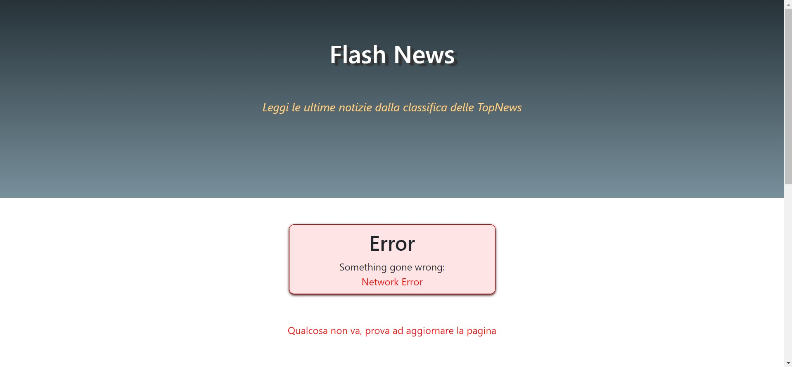

# **Flash news to Hacker News**
## **Prerequisiti:** 
#### - Avere un browser recente ( Chrome, Firefox, Safari...ecc ).

 

## **Funzioni principali:** 

* #### VIsualizzare le ultime notizie tramite le API di Hacker News dalla sezione *Top news*

* #### Funzione di aggiornamento automatico delle ultime notizie

* #### Possibilità di caricare le notizie meno recenti

## **Visita la pagina:** 

* ### [_Flash news_](https://giovannipacelli2.github.io/news/src)

 

# **Organizzazione dei file:** 

#### Nella cartella principale "_src_" sono presenti:

* #### Il file _index.html_
* #### La cartella _assets_

#### La cartella _assets_ a sua volta contiene:

* #### la cartella **css** : contenente i fogli di stile

* #### la cartella **img** : contenente tutte le immagini

* #### la cartella **js** : che contiene il file main.js (entry point) e la cartella _modules_ che contiene le librerie.

 

## Suddivisione dei file JavaScript:

### **main.js** :

1. #### Il **main.js** contiene la funzione primaria **main()** che si occupa di eseguire il codice di "_alto livello_" e comprende tutte le variabili globali condivise con i moduli.

2. #### Sotto alla dichiarazione di **main()** si trovano tutte le funzioni "_interne_":
    * #### le funzioni **refresh**, **seeMore** e **requireMoreNews** che gestiscono il pulsante che carica più notizie.
    * #### le funzioni per la gestione specifica degli errori.

### **news-function-library.js** :

#### Si occupa di tutto ciò che riguarda le news e contiene:
* #### le funzioni che gestiscono le richieste di rete ad Hacker News come la richiesta degli id delle topnews ed il recupero delle notizie stesse tramite quegli id. Ognuna di queste funzioni gestisce eventuali errori. 

* #### le funzioni addette ad inserire dinamicamente le cards (contenenti le notizie) all'interno della pagina

### La classe **Notice** :

1. #### Astrae il concetto di notizia e comprende tutti i metodi atti a costruirne la veste grafica
2. #### Possiede una variabile statica _argumentsOrder_ nella quale è memorizzato l'ordine preciso in cui il costruttore vuole le proprietà.
 

# **Screenshot dell'app:**

## Vista Mobile

 

## Vista PC

 

## Schermata d'errore

 

# **Link utili:**

### - [Sito personale (portfolio)](https://giovannipacelli2.github.io/portfolio/)

### - [Link al sito](https://giovannipacelli2.github.io/news/src)

### - [Breve presentazione](https://giovannipacelli2.github.io/counter/assets/presentation/Presentazione_Counter.pdf)